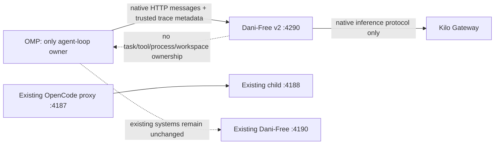

# Dani-Free architecture and operational review

**Historical launch gate (2026-09-20):** an earlier plan required both Kilo and OpenCode before launch, using public/non-sensitive data only. OpenCode explicitly prohibits free-tier use in other harnesses. See [external-access research and verified implementation defects](EXTERNAL_ACCESS_RESEARCH.md). No universal-proxy launch is authorized or verified.

This document's current product is the standard listener on `127.0.0.1:4190`: three OpenCode free ids, then three Kilo free ids. `auto` starts a six-model OpenCode-first failover chain at `opencode/nemotron-3-ultra-free` (missing or unhealthy models are skipped; transport errors, 408s, 429s, 5xx, and HTTP 200 with empty content advance to the next model; a request-deadline timeout ends the chain with a 504 instead of advancing; any other 4xx refusal is passed through as-is). Later sections keep a work log of earlier Kilo-only and Kilo/MiMo routing. Treat historical sections as a work log, not release acceptance.

**Evidence correction:** historical sections below contain superseded current-state wording. The current `:4190` contract is OpenCode then Kilo as listed by `/v1/models`; missing or unhealthy models are skipped, and transport errors, 408s, 429s (after a brief pause), 5xx, and HTTP 200 with empty content fail over to the next model in the chain. A request-deadline timeout ends the chain with a 504 instead of advancing. Any other 4xx refusal from an upstream is returned to the caller as-is.
---

## 1. Executive summary

Dani-Free is a local OpenAI-compatible router on `127.0.0.1:4190`. `auto` starts the six-model OpenCode-first failover chain at `opencode/nemotron-3-ultra-free`. `:4290` is Kilo-only with `auto` → Nex Pro.

The external legacy OpenCode proxy, when separately configured, is a distinct service on `127.0.0.1:4187` with its own `opencode serve` child on port `4188`. Dani-Free does not own that service, its agent loop, or its tool policy.

```text
OMP or another client
Dani-Free :4190
  OpenCode (auto → nemotron-3-ultra-free)
  Kilo Code (nex-n2.5-pro, dots-3-note-preview, nex-n2.5-mini)
```

The router is a **model request router**. It is not the owner of OMP's subagent policy, task scheduling, conversation compaction, or tool loop. Those remain OMP responsibilities.

---

## 1a. Current system versus planned extensions

| Concern | Standard `:4190` | Historical Kilo-only canary `:4290` | Future work |
| --- | --- | --- | --- |
| Deployment state | current product | earlier isolated experiment | full OMP coding acceptance |
| Providers | OpenCode-first six-model failover chain; `auto` = `opencode/nemotron-3-ultra-free` | Kilo only | verified policy snapshot and deeper telemetry |
| OpenCode boundary | first-class provider on the standard listener via the `opencode serve` session bridge; the external legacy proxy is a separate service | not reachable from this service | official ACP integration belongs to an ACP client |
| Tool fidelity | Kilo request fields pass through unchanged | Kilo request fields pass through unchanged | native OMP edit/test proof |
| Discovery | five-second per-adapter request cache over the OpenCode-first six-model roster | same router cache over Kilo only | asynchronous signed/verified policy |
| Billing admission | server allowlist pins the primary model | live Kilo catalogue zero prompt/completion price filtering | all billable dimensions and entitlement policy |
| Service owner | launchd `com.dani-free` | launchd `com.dani-free.kilo-only` | no shared process |
| Rollback | current listener | change OMP URL back to `:4190` | formal rollback test |

### v2 non-negotiable boundaries

1. **OMP owns agency.** For OMP callers, only OMP may own the agent loop, task creation, tools, files, context, approvals, and tool results.
2. **Dani-Free v2 is inference-only.** It must not start OpenCode/Kilo CLIs, mount workspaces, execute tools, create tasks, or call back into a harness session.
3. **Legacy isolation.** `:4187`, `:4188`, and `:4190` remain independently owned and untouched. A canary can roll back by changing its URL from `:4290` back to `:4190`.
4. **No unproven native OpenCode path.** The current `opencode serve` session bridge flattens messages and does not provide native tool fidelity. It is not a v2 agentic provider.
5. **No accidental billing.** Documentation labels, `:free` names, or catalogue presence alone are insufficient; exact model ID, both price dimensions, entitlement, health, and capability must be recorded in policy before admission.

---

## 2. Components and ownership

| Component | Address / path | Owner | Responsibility |
| --- | --- | --- | --- |
| OMP harness | `~/.omp/agent/` | OMP | conversation state, tool calls, subagents, role-to-model assignment |
| Dani-Free | `127.0.0.1:4190` | launchd `com.dani-free` | OpenAI-compatible router; standard listener is OpenCode-first, then Kilo; `auto` starts the six-model chain at `opencode/nemotron-3-ultra-free` and fails over across it |
| Dani-Free Kilo-only canary | `127.0.0.1:4290` | launchd `com.dani-free.kilo-only` | historical isolated Kilo-only inference listener |
| Legacy OpenCode proxy | `127.0.0.1:4187` | external launchd service | separate OpenAI-compatible compatibility service; not an ACP bridge or Dani-Free automatic route |
| Legacy OpenCode child server | `127.0.0.1:4188` | supervised by the external proxy | separate OpenCode session process; not owned by Dani-Free |
| Kilo | remote | Kilo | Kilo model catalogue and completions |
| MiMo | configurable | MiMo | optional adapter; not on the standard listener and never an `auto` fallback |
| Legacy OpenCode model registry | `~/.hermes/opencode-proxy/models.json` | external refresh script + proxy | legacy OpenCode model list and measurements; outside Dani-Free auto routing |
| Daily legacy refresh | launchd `ai.opencode-proxy.refresh-models` | external launchd service | refreshes the separate OpenCode proxy registry |

### Port contract

```text
4187  external legacy OpenCode proxy only
4188  external legacy OpenCode child only; not addressed by Dani-Free automatically
4190  Dani-Free standard OpenCode-first listener (`auto` → opencode/nemotron-3-ultra-free, six-model failover chain)
4290  historical isolated Dani-Free Kilo-only canary
```
Any second listener on those ports is a configuration error. The external proxy must not be started by both launchd and another supervisor.

---

## 3. OMP layer

OMP is the outer harness. It decides whether to call tools, create background work, use an advisor, compact context, or make another model turn. Dani-Free cannot prevent any of those decisions because it only sees individual completion requests after OMP has already made them.

### Current role configuration

The observed `~/.omp/agent/config.yml` is:

```yaml
modelRoles:
  vision: xai-oauth/grok-4.3:xhigh
  advisor: dani-free/auto:xhigh
  smol: dani-free/auto:xhigh
  default: openai-codex/gpt-5.6-terra:medium
```

Implications:

- An explicitly selected `dani-free/auto` conversation uses Dani-Free.
- Advisor and small-model work use Dani-Free.
- The global `default` role is **not** Dani-Free; it is OpenAI Codex at medium thinking.
- Existing sessions and already-created background tasks can retain the role/model chosen when they started.
- OMP can still create subagents or background tasks. Changing a provider cannot itself disable that orchestration behavior.

### Why an OMP turn can show eight minutes

The `Working… 8m` timer measures the whole OMP turn, not one HTTP request. It can include:

1. building/re-resolving a large conversation context;
2. one or more model completions;
3. tool calls and follow-up completions;
4. waiting for background tasks;
5. provider queue time.

The OpenCode proxy logs showed real completions from roughly 50 seconds to 117 seconds while handling large prompt contexts. The proxy has two execution slots. Two slow requests plus a queued third request can make one OMP turn look stalled even when the HTTP services are technically healthy.

---

## 4. Dani-Free layer

Source: `src/router.ts`, `src/server.ts`, and `src/adapters/`.

### Public API

```text
GET  /health
GET  /v1/models
POST /v1/chat/completions
```

`/v1/models` returns backend-prefixed selectors for the adapters that are configured and discoverable. The standard listener allowlists three OpenCode free ids and three Kilo free ids, so the advertised set is:

```text
opencode/nemotron-3-ultra-free
opencode/muse-spark-1.3-contributor-free
opencode/mimo-v2.5-free
kilo/nex-agi/nex-n2.5-pro:free
kilo/dots-studio/dots-3-note-preview:free
kilo/nex-agi/nex-n2.5-mini:free
```

`mimo/<model-id>` appears only when that adapter is deliberately supplied. It is not part of standard `dani-free start` and is never `auto`.

### Request modes

#### Explicit request

```text
model: kilo/<model-id>
```

The router resolves the explicit selector first. If that attempt fails with a retryable condition (transport error, 408, 429, 5xx, an attempt whose per-attempt deadline fired, an HTTP 200 with empty content, an HTTP 200 with an invalid JSON body, an HTTP 200 carrying an error envelope, or an HTTP 200 with a body exceeding the 8 MiB buffer cap), the router continues with the rest of the standard OpenCode-first chain. A missing or unhealthy explicit model fails closed without touching the chain. An explicit request is answered by whichever backends have an adapter supplied: the standard listener supplies OpenCode and Kilo (defaultAdapters), the Kilo-only listener supplies Kilo, and `mimo/<id>` answers only when that adapter is deliberately supplied.

#### Automatic request

```text
model: auto
```

`auto` starts the OpenCode-first six-model failover chain at `opencode/nemotron-3-ultra-free` — not an alias: if nemotron fails, another model in the chain answers. A missing or unhealthy model is skipped; a transport error, 408, 429 (pauses briefly with backoff honoring the upstream Retry-After when present, then advances — no pause after the final attempt), 5xx, an attempt whose per-attempt deadline fired (the chain walks on immediately with an `attempt timed out` reason — the 429 cooldown only applies to rate limits), an HTTP 200 with empty content, an HTTP 200 with an invalid JSON body, an HTTP 200 carrying an error envelope, or an HTTP 200 whose body exceeds the 8 MiB buffer cap fails over to the next model. Any other 4xx refusal is returned to the caller as-is. If every model in the chain fails, the caller gets a 503 `all_models_failed` with per-attempt reasons.

A former work-log policy treated network errors, HTTP 429, and HTTP 5xx as retryable across a Kilo-then-MiMo candidate list, and a later Kilo-only canary pinned `auto` to one Kilo model with no second-model retry. Neither policy is current `:4190` behavior; attempt timeouts remain retryable today (they fail over to the next model immediately, with no backoff).

### Discovery cache

Dani-Free keeps a per-backend model cache for five seconds.

```text
first request or expired cache
list configured adapters (standard start: OpenCode and Kilo)
cache successful model lists for 5 seconds

subsequent request during TTL
reuse cached lists
```

Discovery runs inside the request timeout. A concurrent request reuses the same pending discovery promise rather than starting duplicate provider requests. Standard start does not discover MiMo.

### Time budgets

The effective timing policy is:

| Scope | Limit | Purpose |
| --- | ---: | --- |
| configured router request timeout | normally 180 seconds from runtime config (`DANI_FREE_REQUEST_TIMEOUT_MS`; default `180_000` in `src/config.ts`) | single-attempt bound when the server was started through its configuration loader |
| Router class fallback default | 120 seconds | used only if the server was not started through the configuration loader |
| incoming request signal | propagated through the attempt | client cancellation is terminal and stops the attempt |

There is no 30-second per-candidate retry window and no 90-second `auto` fallback budget. `auto` is the OpenCode-first six-model failover chain starting at `opencode/nemotron-3-ultra-free`; a transport error, 408, 429 (with backoff), 5xx, or an attempt-timeout (immediate failover, no backoff) fails over to the next model, and if all fail the caller gets a 503 `all_models_failed`. A per-attempt deadline bounds each attempt only up to its response headers; once a model answers, the shared request deadline (and client cancellation) stays active through streamed response EOF.

### Important limit

A single-attempt timeout cannot make a model complete a difficult 70k-token prompt quickly, and it cannot cap an OMP turn that internally performs several distinct completions or tool iterations. The former 90-second `auto` budget that tried serial model fallback is work-log history, not current `:4190` behavior.

---

## 5. Legacy OpenCode proxy layer (external, non-automatic)

Source: `~/.hermes/opencode-proxy/server.ts`.

This section documents a separate external compatibility service. It is not the official OpenCode ACP integration, is not owned by Dani-Free, and is not part of current `auto` (the OpenCode-first failover chain starting at `opencode/nemotron-3-ultra-free`). It may be used only by an explicit legacy adapter configuration.

OpenCode's free upstream rejects plain external OpenAI calls. The external proxy runs `opencode serve`, creates an OpenCode session, sends a prompt through that session, captures the completed message, and converts it back to an OpenAI chat-completion response.

```text
Dani-Free sends OpenAI chat format
        |
        v
OpenCode proxy flattens messages into system + prompt text
        |
        v
proxy creates a real OpenCode session
        |
        v
proxy prompts `opencode serve`
        |
        v
proxy returns a synthetic OpenAI response
```

### Concurrency control

The proxy permits two concurrent OpenCode sessions:

```text
MAX_CONCURRENT = 2
```

A third request waits in the queue. This deliberately protects `opencode serve`, which is documented in the source as unreliable under higher parallel session load. It is also a direct source of latency during OMP background task bursts.

### Legacy proxy priority (not Dani-Free auto order)

The external proxy enforces its own top priority, regardless of accidental ordering in its registry:

```text
1. muse-spark-1.3-contributor-free
2. muse-spark-1.2-contributor-free
3. mimo-v2.5-free
4. nemotron-3-ultra-free
5. ling-3.0-flash-fin-free
6. nemotron-3.5-lightning-free
```

The first three are hardcoded as a priority list in the external proxy's `server.ts`. The registry stores the same order after the current refresh. This priority does not control Dani-Free auto routing.

### Tool policy: critical quality constraint

The OpenCode proxy's child configuration explicitly enables only:

```text
bash
webfetch
websearch
```

and disables:

```text
read, write, edit, apply_patch, glob, grep, codesearch, patch,
question, skill, todowrite, todoread, task
```

This means a model reached through the external `opencode-free` proxy or an explicit legacy OpenCode adapter **cannot directly use file-editing tools supplied by the OpenCode child service**. This is a major explanation for lower coding-agent quality compared with a normal full OpenCode harness. The outer OMP harness has its own tools, but the proxied model's own tool environment is restricted.

### Message transformation: another quality constraint

The proxy flattens the original OpenAI message array into one system string and one text prompt. It does not forward native tool calls, structured tool results, multimodal parts, or stream incremental model output as native OpenCode events. This loses agent state fidelity and is unsuitable for treating the OpenCode proxy as a transparent replacement for full OpenCode.

---

## 6. Legacy OpenCode model registry, research, and refresh

### Registry

File: `~/.hermes/opencode-proxy/models.json`

The registry has three roles:

```text
working  verified models accepted and advertised by the proxy
broken   known failures with a recorded reason
ranking  persisted local benchmark measurements and optional external evidence
```

A probe-in-progress file carries `probing: true`. The proxy keeps serving its last verified model list instead of exposing unverified candidates.

### Refresh flow

```text
launchd daily/login trigger
        |
        v
refresh-if-stale.sh
        |
        +-- skip if verified registry + complete ranking are < 24 hours old
        |
        v
probe-models.sh
        |
        +-- collect candidates from OpenCode CLI, official OpenCode catalogue, old registry
        +-- test candidates through the live local proxy
        +-- write verified working/broken registry atomically
        +-- collect web research evidence
        +-- run local microbenchmark
```

### Research evidence

`model-research.py` fetches:

```text
official OpenCode catalogue
open-websearch CLI when available
DuckDuckGo HTML fallback
Google News RSS fallback
```

Search data is discovery evidence only. It must not become a numeric ranking automatically because model variants, prompting, benchmark versions, and evaluator setups may differ.

### Local benchmark

`benchmark-models.py` asks five small deterministic coding/reasoning multiple-choice questions and records accuracy plus median latency. It is a smoke signal for obvious failures. It is **not** SWE-bench, Terminal-Bench, or an adequate measure of long-horizon code-agent quality.

The currently persisted measurements should not be read as a definitive global model leaderboard.

---

## 7. Kilo and MiMo layers

### Kilo

The Kilo adapter speaks to the Kilo gateway, lists the models marked free, and forwards the provider's native model ID unchanged. It is a distinct remote provider, not a local Kilo proxy. Its behavior and configuration remain unchanged by the OpenCode boundary.

Current `auto` walks the OpenCode-first six-model failover chain starting at `opencode/nemotron-3-ultra-free`. A former work-log order tried Kilo then MiMo, and a later canary pinned `auto` to the Kilo model only; neither is current `:4190` behavior.

### MiMo

MiMo supports either a verified OpenAI-compatible endpoint or Xiaomi's verified `mimo serve` protocol. It has historically been unstable/unavailable in this setup. Its health may be reported as healthy or unhealthy depending on which local command/endpoint is available at request time.

MiMo is not on the standard listener and is never an `auto` fallback. A model merely appearing in `/v1/models` is not proof that it is a useful or consistently available completion path.

---

## 8. Present routing diagram

```text
OMP or API client
Dani-Free :4190
  five-second per-backend discovery cache
  auto: OpenCode-first six-model failover chain (auto → opencode/nemotron-3-ultra-free)
  explicit backend/model: explicit attempt first, then the rest of the chain on retryable failure
  optional explicit MiMo adapter: never automatic, not standard start
OpenCode adapter: opencode serve session bridge
Kilo adapter: Kilo gateway
MiMo adapter: configured MiMo service (not standard start)
```

---

## 9. Failure behavior

| Symptom | Layer | Meaning | Current response |
| --- | --- | --- | --- |
| `401` | Dani-Free | local API key mismatch | reject request |
| `413` | Dani-Free | request body exceeds the body cap (4 MiB via `dani-free start`; `DANI_FREE_BODY_LIMIT_BYTES` to change; 1 MiB router-library default) | reject request |
| `404 model_not_found` | adapter/router | explicit model absent | do not fall back |
| `429` | provider | provider rate limit | fail over to the next model after a backoff that honors the upstream `Retry-After` header when present (clamped at 30s), plus jitter |
| `5xx` | provider | transient upstream failure | fail over to the next model |
| HTTP 200 with empty content | provider | empty-content quirk | fail over to the next model |
| HTTP 200 with oversized body | provider | body exceeds the 8 MiB buffer cap | fail over to the next model |
| `504 timeout` | router | shared request deadline reached | return 504; remaining models are not tried |
| all models failed | router | every model in the chain failed | 503 `all_models_failed` with per-attempt reasons |
| cancellation | router | incoming request signal fired | propagate cancellation and stop; do not retry or fall back |
| capability mismatch | router | candidate cannot satisfy request | exclude candidate; do not silently switch an explicit selector |
| `/health` degraded | one or more backends | discovery/health failure | inspect per-backend reason |
| external OpenCode queue growth | legacy proxy | more than two live external proxy requests | requests wait; this can dominate perceived latency but does not affect standard auto routing |

---

## 10. Architecture defects and why they matter

### A. Multiple policy authorities

Legacy OpenCode priority exists in the external proxy's `models.json`, benchmark tooling, and proxy server. This is duplicated state outside Dani-Free. A single `model-policy.json` should eventually be the sole policy authority for that legacy service.

### B. Provider order is not quality policy

Dani-Free's standard `auto` is `kilo/nex-agi/nex-n2.5-pro:free`. A former automatic pool was Kilo Code followed by MiMo Code; that is work-log history. OpenCode is excluded from automatic routing. Pinning one model is a compatibility boundary, not a universal ranking of quality, speed, remaining quota, or reliability.

### C. No quota telemetry

The router learns that a provider is exhausted only after receiving a failure. It has no consistent cross-provider remaining-token or daily-credit source. Therefore it cannot truthfully guarantee “use the best model until credits run out” before the provider first says no.

### D. Explicit legacy OpenCode compatibility reduces agent capability

The external proxy intentionally disables editing/file-navigation/task tools and flattens structured messages. A model reached through an explicit legacy adapter is less capable than the same model in a native OpenCode session with its full tool environment. This is not the official OpenCode ACP integration.

### E. OMP orchestration is outside the router

Dani-Free cannot stop OMP from delegating. It cannot reduce an OMP turn made of ten tool/model cycles to one cycle. A full solution needs OMP-level delegation policy and role assignment, not just provider routing.

### F. Two-slot external proxy concurrency creates queuing

The concurrency cap protects the external child server but produces a queue under subagent bursts. Raising it blindly can make the child server unreliable or trigger rate limits; lowering it increases queue delay. This is a throughput-versus-stability control, not a free performance win, and it is outside standard auto routing.

### G. The tiny benchmark is not a true quality evaluator

Five multiple-choice prompts cannot establish long-horizon coding quality. It should be retained only as a health/regression check unless replaced with reproducible code-agent tasks.

---

## 11. Review checklist

Use this checklist before claiming this stack is high quality:

- [ ] One model-policy file owns tiers, model order, and availability state for any legacy service that still uses one.
- [ ] OMP's `default`, `advisor`, and `smol` roles intentionally point at the intended provider(s).
- [ ] Existing OMP session and background-task model assignments have been inspected after role changes.
- [ ] MiMo is not auto-routable on the standard listener.
- [ ] Model policy distinguishes `healthy`, `rate_limited`, `cooldown`, `exhausted`, and `disabled`.
- [ ] Standard `auto` starts the six-model OpenCode-first failover chain at `opencode/nemotron-3-ultra-free` and fails over on retryable failures.
- [ ] Requested capabilities are checked before candidate selection.
- [ ] `auto` is one attempt; missing, unhealthy, 429, 503, and timeout return that error.
- [ ] The shared request deadline and client cancellation stay active through streamed response EOF; per-attempt deadlines bound each attempt only up to its response headers.
- [ ] Explicit selectors fail closed and upstream statuses are preserved.
- [ ] OpenCode remains an explicit legacy compatibility boundary, not an automatic fallback or official ACP bridge.
- [ ] The external OpenCode proxy tool restrictions are either accepted by design or removed with a security review.
- [ ] The external OpenCode proxy queue has observability and a tested saturation behavior.
- [ ] Any external benchmark score records exact model variant, benchmark version, evaluator, source URL, date, and conditions.
- [ ] End-to-end OMP measurement distinguishes model time, queue time, tool time, and orchestration time.

---

## 12. Safe operational commands

```sh
# Router health and model list
curl -fsS http://127.0.0.1:4190/health
curl -fsS http://127.0.0.1:4190/v1/models

# OpenCode proxy health, including queue depth
curl -fsS http://127.0.0.1:4187/health

# Restart only Dani-Free after its code/config changes
launchctl kickstart -k gui/$(id -u)/com.dani-free

# Restart only the launchd-owned OpenCode proxy after its code/plist changes
launchctl kickstart -k gui/$(id -u)/ai.opencode-proxy

# Refresh and probe OpenCode model availability manually
cd ~/.hermes/opencode-proxy
./probe-models.sh
```

Do not start a second external OpenCode proxy manually on port 4187 while its launchd owner is active.

---

## 13. Bottom line

The stack is a useful local compatibility layer, but it is not a transparent replacement for native OpenCode, an official OpenCode ACP bridge, or a fully quality-aware model router.

The currently correct narrow claim is:

```text
Dani-Free's standard `:4190` listener is OpenCode-first, then Kilo; `auto` starts the six-model chain at `opencode/nemotron-3-ultra-free` and fails over across it (transport errors, 408, 429 with backoff, 5xx, empty or oversized 200s), passing other 4xx refusals through as-is.
```

The claim it cannot currently support is:

```text
Dani-Free automatically selects the globally best coding agent with full native tool capability and known remaining quota.
```

The most important review question is whether the external legacy OpenCode proxy's intentionally restricted tool environment is acceptable for the explicit compatibility use case. It must not be mistaken for the official OpenCode agent transport or an automatic Dani-Free route.

---

## 14. Historical v2 design constraints

The decision map is [Dani-Free v2 canary-ready plan](../.wayfinder/dani-free-v2-canary-map.md). It records the constraints and decisions that shaped the now-deployed Kilo-only canary; section 17 is authoritative for current state.




`V2` must be a new process with a distinct local address, configuration, policy snapshot, and canary client configuration. It must not repurpose any legacy port or launchd unit.

### 14.2 Native protocol boundary

The v2 router may accept a request only after it can validate the format and the selected candidate's capability:

```text
incoming selector, messages, tools, tool_choice, images,
context/output limits, request ID, trusted harness metadata
        |
        v
atomic last-verified policy snapshot
        |
        v
free-entitlement + availability + privacy + capability filtering
        |
        v
one eligible Kilo-native model, pinned for the safe tool sequence
        |
        v
native response: role/content/tool-call IDs/tool deltas/
finish reason/usage preserved without session flattening
```

The router must reject unsupported protocol features descriptively. It must not silently flatten role history, images, assistant tool calls, tool results, or streaming deltas into a text prompt.

### 14.3 Candidate admission and routing

The planned policy record needs, at minimum:

| Field | Why it exists |
| --- | --- |
| policy revision and `verified_at` | lets a canary identify exactly which policy selected a model |
| exact provider/model slug and endpoint | prevents aliases from hiding a model change |
| input and output prices | proves the model is zero-cost in both billing dimensions |
| entitlement and provider conditions | distinguishes advertised from usable |
| tool, streaming, image, context, and output capabilities | prevents protocol-incompatible routing |
| availability, cooldown, success/failure counts | prevents known-bad candidates from being retried blindly |
| evidence URL/date and audit reference | makes admission reviewable |

Routing must preserve user preference only **within** eligible candidates. Candidate state is:

```text
unverified | available | cooling_down | exhausted | disabled
```

`unverified` is never a silent fallback. A `429` applies a `Retry-After` cooldown where available; a `403` or free-tier denial quarantines the model; a schema `400` fails hard because a translator defect must be fixed rather than routed around.

Retry is permitted only before any output, tool call, or side effect, and only within the request deadline. Once a stream begins, v2 returns an error rather than replaying partial work on another model. A tool sequence pins the selected model unless the invoking harness explicitly approves a safe-boundary switch.

### 14.4 Policy refresh is outside inference

The planned `catalog-refresh` service runs asynchronously at boot and on a low-frequency cadence. It reads official catalogue/pricing sources, validates and atomically writes a new snapshot, and retains the last valid snapshot when refresh fails.

The request path must never:

- launch web research;
- benchmark a model;
- discover every provider synchronously;
- write policy state;
- infer that a documentation claim equals live entitlement.

The optional daily research worker records source provenance and comparability limits. It cannot change runtime ranking directly. Any public-search result is discovery evidence, not executable instruction or pricing authority.

### 14.5 Correlated tracing contract

The initial design requires one trace ID carried only across trusted local boundaries. User-supplied headers are not authorization. Trace output must omit secrets and raw proprietary prompts by default.

Required spans:

```text
parent_turn_start
  parent_model_request_start
  dani_router_received
  model_discovery_cache_hit_or_miss
  provider_queue_enter / provider_queue_exit
  provider_http_request_start
  provider_first_byte
  provider_first_token
  provider_response_end
  omp_tool_call_received
  omp_task_preflight_start
  omp_subagent_registered
  omp_child_session_started
  omp_child_model_request_start
  omp_child_first_token
  omp_child_result
parent_turn_end
```

The resulting histograms separate:

```text
time to task decision
dispatch overhead
provider queue wait
provider generation
child-session duration
result delivery
```

Each trace also records selected actual model, attempt number, fallback reason, request and token counts, prompt length, `Retry-After`, rate limits, and redacted provider-error class. This is the evidence needed to distinguish an OMP orchestration delay from provider queueing or generation time.

### 14.6 Canary evidence gate

No OMP URL changes until all of the following pass against the isolated `:4290` service:

1. Mock-upstream protocol tests for exact tool IDs, tool choice, streaming deltas, finish reasons, usage, cancellation, timeout, `403`, `429`, and `5xx`.
2. Tests proving no provider with non-zero input or output price is admitted.
3. A fresh-session OMP canary that performs a native edit/test loop using a confirmed Kilo-native tool-capable candidate.
4. Trace evidence separating OMP dispatch, router processing, provider queueing, and generation.
5. A 30k+ context case.
6. Fifty sequential and five concurrent canary tasks without cross-harness task execution, unexpected paid routing, or queue explosion.
7. URL-only rollback verified: move the canary URL back to `:4190`; do not stop or mutate legacy services.

### 14.7 Current planning status

| Decision ticket | State | What is still needed |
| --- | --- | --- |
| Verify Kilo native free transport | open | Official/free-entitlement evidence and native protocol facts for the actual installed account and gateway |
| Audit actual OMP task ownership | open | Installed OMP version, effective roles, task semantics, advisor/retry behavior, and agent-definition audit |
| Define correlated trace contract | open | Exact source insertion points and a trusted parent/child propagation boundary |
| Choose v2 native router contract | blocked | Depends on verified Kilo transport facts |
| Choose canary overlay and evidence gate | blocked | Depends on all prior research and the router contract |

An earlier attempt to resolve the three research tickets through `dani-free/auto` did not produce findings: it exhausted the current router's 90-second automatic-routing budget. That is an observed routing-worker failure, not evidence that Kilo, OMP, or tracing requirements have been resolved.

### 14.8 Scope boundary

This architecture review does **not** claim:

- a deployed v2 server;
- verified free native Kilo tool transport;
- native agentic OpenCode free access;
- a measured improvement in end-to-end OMP quality;
- a completed benchmark suite;
- authority to alter existing services.

Those claims require the ticket evidence and canary tests above.

## 15. Connection outage and service ownership repair

On 2026-09-20, port 4190 refused connections. The previous OMP-managed process had exited with status 0 and used `restart=no`, `persist=false`, `detached=false`. The precise exit trigger was not recorded.

Installed the existing package launchd template as `~/Library/LaunchAgents/com.dani-free.plist`, with `RunAtLoad` and `KeepAlive`. Logs: `~/Library/Logs/dani-free/`. Do not start a duplicate OMP-managed listener. No OpenCode process or configuration was changed.


## 16. Kilo-only implementation status

Implemented:

- `src/kilo-only.ts`: isolated Bun entrypoint with only `KiloAdapter`.
- `src/adapters/kilo.ts`: anonymous catalogue, health, completion, and streaming support when Kilo permits unauthenticated free inference; optional bearer authentication remains supported when configured.
- Live Kilo model priority based on exact currently advertised IDs, with unavailable shortlist entries skipped.
- `~/Library/LaunchAgents/com.dani-free.kilo-only.plist`: durable `:4290` service with independent logs.
- OMP `dani-free` provider URL moved from `:4190` to `:4290`; a timestamped backup was created first.

Observed evidence:

```text
GET :4290/health                         PASS
GET :4290/v1/models                      PASS
POST :4290 model=auto stream=true        PASS, HTTP 200, ~2.5s
POST :4290 native tools                  PASS, finish_reason=tool_calls
GET :4190/health                         PASS, legacy service retained
```

The direct Kilo catalogue currently admits only models whose live metadata reports zero prompt and completion pricing. The catalogue also exposed models absent from the supplied shortlist; they are not automatically treated as proven coding winners. The first live auto selection was `nex-agi/nex-n2.5-pro:free`.

Not yet proven:

- Fresh OMP greeting through a newly launched session.
- Full OMP read/edit/test coding loop.
- Ten-task or larger comparable model benchmark.
- Cancellation, concurrent saturation, and rollback acceptance suite.
- Whether every advertised Kilo tool-capable model preserves tool calls under all OMP message shapes.

---

## 17. Complete implementation record: Kilo-only canary

This section is the operational source of truth for what was actually changed on 2026-09-20.

### 17.1 Exact process topology

```text
OMP provider `dani-free`
        |
        | http://127.0.0.1:4290/v1
        v
launchd: com.dani-free.kilo-only
        |
        | /Users/dan/.bun/bin/bun run src/kilo-only.ts
        v
createRouterServer({ adapters: [new KiloAdapter()] })
        |
        | HTTPS fetch, no CLI and no subprocess
        v
https://api.kilo.ai/api/gateway
```

The service cannot reach the OpenCode adapter, MiMo adapter, OpenCode CLI, Kilo CLI, workspace, shell, or OMP task API. Its only adapter is instantiated directly in `src/kilo-only.ts`.

### 17.2 Launchd ownership

`~/Library/LaunchAgents/com.dani-free.kilo-only.plist` defines:

```text
label:           com.dani-free.kilo-only
working dir:     /Users/dan/Desktop/x/dani-free
executable:      /Users/dan/.bun/bin/bun
entrypoint:      run src/kilo-only.ts
host:            127.0.0.1
port:            4290
Kilo base URL:   https://api.kilo.ai/api/gateway
timeout:         45000 ms
run at login:    yes
keep alive:      yes
stdout:          ~/Library/Logs/dani-free/kilo-only.log
stderr:          ~/Library/Logs/dani-free/kilo-only.error.log
```

The legacy `com.dani-free` service remains separate on `:4190`. The OpenCode launchd service remains separate on `:4187`, with its child on `:4188`. No existing OpenCode service was changed or restarted for the Kilo-only implementation.

### 17.3 Adapter behavior

`KiloAdapter` uses `https://api.kilo.ai/api/gateway` by default and supports an override through `DANI_FREE_KILO_BASE_URL`. If `DANI_FREE_KILO_API_KEY` exists, it sends `Authorization: Bearer ...`; otherwise it sends no authorization header. This is deliberate because the live free gateway accepted anonymous requests.

The adapter:

1. Fetches `GET /models`.
2. Parses only rows with a non-empty string `id`.
3. Maps context and output limits from the provider metadata.
4. Always advertises text.
5. Advertises image only when provider metadata says image, vision, or multimodal.
6. Always advertises text, tools, and reasoning (these are not gated on provider metadata); image follows point 5.
7. Filters to the curated free roster in `CANONICAL_FREE_MODEL_IDS` (the free-tier-only invariant); any model not on that roster is never advertised, regardless of discovery.
8. Applies the configured preference order without inventing missing models.
9. Sends `POST /chat/completions` with the original request fields plus the exact discovered model ID.
10. Preserves `stream`, `messages`, `tools`, `tool_choice`, image parts, tool results, and all other JSON fields because the body is not flattened or reconstructed.
11. Forwards the provider `Response` directly, including SSE streaming.
12. Propagates the caller's `AbortSignal`.
13. Normalizes non-2xx responses into a `KiloBackendError` while retaining status and provider detail.

### 17.4 Current live catalogue

The live request to `GET https://api.kilo.ai/api/gateway/models` returned 380 total records. The currently discovered zero-price candidates included:

```text
kilo-auto/free
poolside/laguna-s-2.1:free
nvidia/nemotron-3-ultra-550b-a55b:free
dots-studio/dots-3-note-preview:free
nex-agi/nex-n2.5-pro:free
inclusionai/ling-3.0-flash-vl:free
nex-agi/nex-n2.5-mini:free
inclusionai/ling-3.0-flash-sante:free
inclusionai/ling-3.0-flash-fin:free
qwen/qwen3.8-27b:free
liquid/lfm-2.5-2.6b:free
nvidia/nemotron-3.5-lightning:free
thinkingmachines/inkling-small:free
poolside/laguna-xs-2.1:free
cohere/north-mini-code:free
z-ai/glm-5.2:free
nvidia/nemotron-3.5-content-safety:free
nvidia/nemotron-3-nano-omni-30b-a3b-reasoning:free
nvidia/nemotron-3-super-120b-a12b:free
openrouter/free
stepfun/step-3.7-flash:free
```

The exact live catalogue did **not** contain every model in the supplied initial shortlist. In particular, `tencent/hy3:free`, `minimax/minimax-m3:free`, and `minimax/minimax-m2.7:free` were not returned during this audit. They are therefore not routed or treated as available.

The catalogue reported zero prompt and completion prices for the admitted `:free` entries. That proves catalogue pricing only; it does not prove permanent availability, privacy, quality, or a successful future completion.

### 17.5 Current priority

The adapter currently orders available models using this exact preference list:

```text
1. nex-agi/nex-n2.5-pro:free
2. minimax/minimax-m3:free              (skipped when absent)
3. minimax/minimax-m2.7:free            (skipped when absent)
4. nvidia/nemotron-3-ultra-550b-a55b:free
5. nvidia/nemotron-3-super-120b-a12b:free
6. inclusionai/ling-3.0-flash-fin:free
7. kilo-auto/free
8. all other live zero-price IDs in gateway order
```

This is a configured preference, not a proven capability ranking. No benchmark was run that justifies calling one model globally “best.”

### 17.6 Router request path

For `POST /v1/chat/completions`:

```text
request arrives
  -> optional local API-key check
  -> bounded body read
  -> JSON parse and model/messages validation
  -> model discovery through Kilo
  -> healthy candidate selection
  -> `auto` aliases the pinned Kilo primary (canary-era candidate lists are work-log history)
  -> the attempt has a router deadline
  -> 429, 5xx, and timeout return that error; no next-candidate retry
  -> successful provider Response is returned unchanged
```

An explicit `kilo/<model-id>` selector does not silently move to another backend. The Kilo-only service has no other backend to use.

A former shared-router `auto` budget of 90 seconds and next-candidate retry is work-log history. Current `auto` is one pinned Kilo model. The Kilo-only happy path completed well below that old budget; a future hardening pass should add a Kilo-specific first-byte/idle-stream policy instead of relying only on a total operation timeout.

### 17.7 Native streaming evidence

Direct Kilo:

```text
model: nex-agi/nex-n2.5-pro:free
request: stream=true, max_tokens=8, "Reply with only OK"
HTTP: 200
time: approximately 0.88 seconds
```

The provider returned multiple SSE chunks, including reasoning/content deltas, a `stop` finish reason, usage, zero cost, and `[DONE]`.

Through `:4290`:

```text
model: kilo/nex-agi/nex-n2.5-pro:free
HTTP: 200
time: approximately 5.22 seconds
```

Automatic `:4290` routing:

```text
model: auto
selected: nex-agi/nex-n2.5-pro:free
HTTP: 200
time: approximately 2.5 seconds
```

The measured difference is provider/runtime timing, not a claim of a stable latency SLA.

### 17.8 Native tool-call evidence

A request containing:

```json
{
  "tools": [
    {
      "type": "function",
      "function": {
        "name": "get_status",
        "description": "Return status",
        "parameters": {"type": "object", "properties": {}}
      }
    }
  ],
  "tool_choice": "auto"
}
```

returned:

```text
HTTP 200
finish_reason: tool_calls
tool name: get_status
arguments: {}
```

This proves the provider and router can transport one native tool call. It does **not** prove that OMP executed the tool and successfully completed a second model turn.

### 17.9 OMP binding

The active OMP provider entry is:

```yaml
dani-free:
  baseUrl: http://127.0.0.1:4290/v1
  api: openai-completions
  auth: none
  models:
    - id: auto
      name: Dani-Free Auto
```

A timestamped backup was created before this URL change. Existing OMP role configuration still determines which role uses the provider. The current OMP configuration has historically assigned `advisor` and `smol` to `dani-free/auto`, while the global `default` role may be separately configured. A fresh OMP session is required to prove the active role actually uses this new URL.

### 17.10 What is proven versus not proven

**Proven:**

- `:4290` is live and launchd-owned.
- The canary is Kilo-only.
- Existing legacy ports remain present.
- Anonymous Kilo model discovery works.
- Live zero-price filtering works at catalogue time.
- A direct free Kilo completion works.
- SSE chunks pass through.
- One native tool-call response passes through.
- `auto` selects the configured live priority.
- TypeScript check passes.
- Existing Dani-Free tests pass: 5 passed, 0 failed.

**Not proven:**

- A fresh OMP `hi` turn through the newly edited provider.
- An OMP tool execution round trip.
- A disposable repository coding task: read, edit, shell test, correction, completion.
- Provider privacy acceptance for every candidate.
- Stable quota behavior or rate-limit recovery.
- Cancellation under an active stream.
- Five-way concurrent behavior.
- Model quality hierarchy.
- Vision/image forwarding through an OMP session.
- Full rollback test.

The correct status is **PARTIALLY WORKING**, not WORKING.

### 17.11 Rollback

To roll OMP back without altering legacy services:

```text
change ~/.omp/agent/models.yml:
  http://127.0.0.1:4290/v1
  -> http://127.0.0.1:4190/v1
```

The backup created before migration is the authoritative restore source. The `:4290` launch agent can remain running independently or be unloaded explicitly after the canary is no longer needed. Do not kill by process name, and do not change `:4187` or `:4188`.

### 17.12 Known implementation gaps

1. The model policy is still code-level preference plus live catalogue filtering, not a signed atomic policy snapshot.
2. The catalogue refresh occurs on request through the existing router cache; the separate asynchronous refresh worker has not been implemented.
3. No structured trace ID is propagated from OMP through `:4290` to Kilo.
4. No provider circuit breaker or persisted cooldown state exists.
5. No model pinning metadata is preserved across an OMP tool sequence.
6. The router's `BackendModel` mapping does not yet expose every Kilo pricing/privacy field.
7. The process currently relies on launchd for restart, not an internal supervisor.
8. Provider SSE is forwarded, but no dedicated conformance test yet asserts chunk timing, cancellation, tool-argument delta ordering, or usage framing.
9. There is no complete OMP fixture proving that only OMP executes tools.
10. “Best model” is not established; current order is preference plus live availability.
